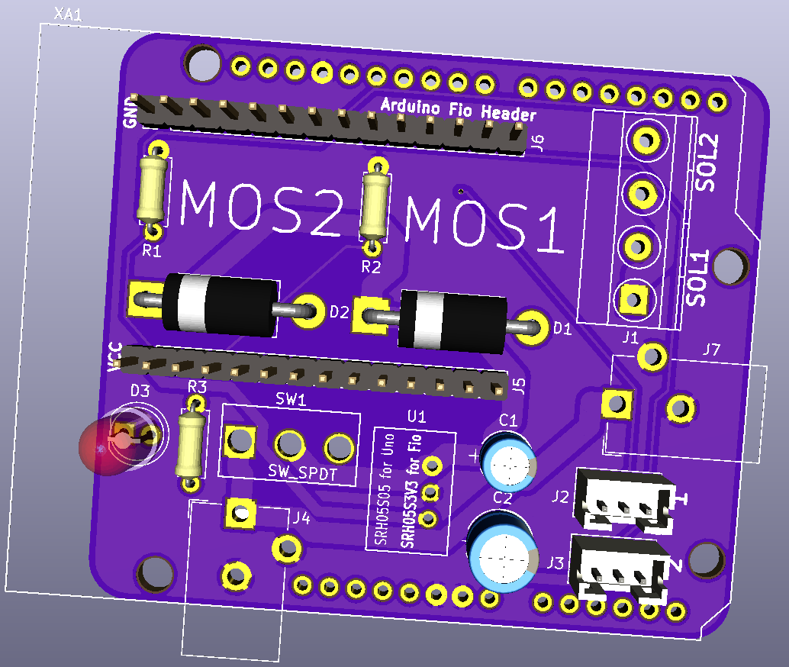

# Cadence Firmware

This projects aims to:

* Read in analog voltages from a [pulse sensor](https://pulsesensor.com/).
* Apply filtering on this signal to determine when heartbeats occur.
* Then drive an actuator upon detecting a heartbeat, or receiving a message over the serial port.

The project was completed on commission for the artist [Sara Dittrich](https://www.saradittrich.com/), and used in several of her works:

* [Cadence](https://www.saradittrich.com/Cadence)
* [The Tender Interval](https://www.saradittrich.com/The-Tender-Interval)

The goal with releasing it is to provide an example project for people looking to use these pulse sensors asynchronously.

## Overview

The Arduino sketch is written to be run on any atmel328-based Arduino, including the Uno and Nano boards. Timers (TIMER1 + TIMER2) are used to consistently read from the sensors and in some configurations drive stepper motors.

A very small serial communication protocol is also implemented to also be able to drive actuators via commands from a host PC. Up to two pulse sensors can drive up to two actuators at a time. See `./serial_protocol_tester` for a python implementation of this protocol.

The core firmware, including the `.ino` file is in `./cadence-firmware`. This is the code that should be uploaded in a production environment.

`config.h` in that directory can be used to tune many aspects of the firmware, including which hardware platform/types of actuators are expected.

There are a few test sketches in `./test` that verify the functionality in the core `cadence-firmware`. These are mostly to aide development and debugging. For each of these sketches, there may or may not be docs at the top of the respective `.ino`s. 

## Platforms

Several different hardware platforms are supported to enable re-use of the core functionality across different projects.

Note: See the

```
/*
  Pin mappings
*/
```

Section of `config.h` to understand how each of these circuits should connect to the Arduino. 

### Silent Dripper PCB


This configuration leverages the TMC2208 to drive small stepper motor peristaltic pumps to water droplets in complete silence. For a technical overview of this use-case see this [blog post](www.esologic.com/silent-dripper).

To use this platform, the following Arduino libraries have to be installed:

* [FastLED](https://www.arduino.cc/reference/en/libraries/fastled/)
* [TMCStepper](https://www.arduino.cc/reference/en/libraries/tmcstepper/)

The [digitalWriteFast](https://github.com/NicksonYap/digitalWriteFast) library is included as a submodule of this repo. It is used to change the state of the `STEP` pins on the TMC's very quickly.

#### LED blink codes

`LED1` maps to the first TMC/Motor, and `LED2` to the second. `LED3` is referred to as the "Indicator LED" in the firmware and relays status for the serial protocol.

##### Startup 

On startup, the Arduino writes to the TMC's to set their drive parameters and query status.

* If the LED is yellow, it means the config is being written.
* If the LED is green, it means the TMC is correctly configured and will behave normally.
* If the LED is red, it means that the TMC is in some sort of a fault state. 

##### Run

* LEDs 1/2 will turn purple if their corresponding motor is enabled and spinning, and turn off if they are disabled.
*  LED3, the indicator LED will blink blue 3 times quickly to indicate that the host PC will start sending messages.
* LED3 will emit 2 long blue blinks to indicate that the host PC has crashed and needs attention.
* LED3 will blink green if it receives a `PULSE_LED` command.

#### Switches

*Input Power*: Flipping this switch all the way to the right connects the DC voltage on the barrel jack to the VMOT pins on the TMCs. This will enable the motors to be driven.

This switch must be flipped for the motors to work even if the Arduino is being powered via USB.

*Arduino Power*: This enables the onboard 5V regulator. Flip this if you'd like to have the arduino running standalone without a PC attached.

*Pulse Drips*: Flip all the way to the right to enable drips on pulse detection on the two sensors. Flipping it to the left will enter a calibration mode, creating drips on both pumps to be able to adjust their size using the potentiometers.

#### Potentiometers

These two potentiometers are used to finely adjust the drop size without having to re-upload the firmware. If at any point you change the position of these knobs the drop size will change. Spin left to make them smaller, right to make them bigger.

### Cadence PCB



The first use-case for this firmware. Used to drive solenoids via MOSFETs for [Cadence](https://www.saradittrich.com/Cadence).

#### LED blink codes

Same indicator LED blinks on D3 as `Silent Dripper PCB`.

### Adafruit Motor Shield v2


This configuration was used to drive the first iteration of [The Tender Interval](https://www.saradittrich.com/The-Tender-Interval).

To use this platform, the following Arduino libraries have to be installed:

* [Adafruit Motor Shield v2](https://github.com/adafruit/Adafruit_Motor_Shield_V2_Library)

## Contributing

PR's are welcome to increase code quality, improve heartbeat detection or support more hardware platforms. A few notes:

* Use doxygen style docstrings. I got stubs for these using [this](https://github.com/cschlosser/doxdocgen) tool.
* `clang-format` using default settings is used to enforce code style.
